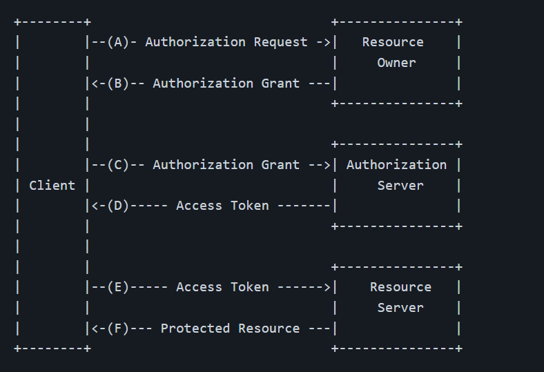
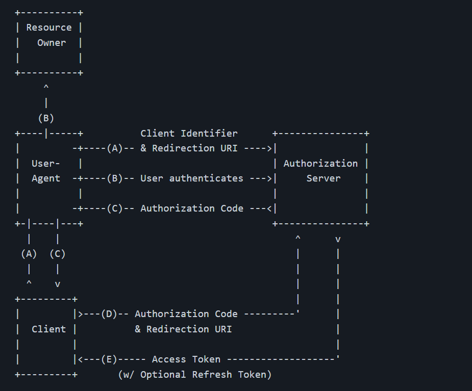

# 基于OAuth2.0协议标准构建的易班OAuth2.0授权登录系统

OAuth2.0授权框架允许第三方应用获取对HTTP服务的有限的访问权限，既可以以资源所有者名义在资源所有者和HTTP服务之间进行允许的交互，也可以允许第三方应用以自己的名义进行访问。

## 一、OAuth2.0介绍

### 常见场景：

- 线上升旗平台通过易班账号授权登陆
- 哔哩哔哩通过微信授权登陆

### OAuth2.0和传统的身份认证模式

- 传统的身份认证模式不可避免的需要和第三方共享密码，则会出现以下问题
  - 假设第三方应用拥有密码，则权限和用户相同，可以获取用户拥有的所有资源，而实际上，我们只想让第三方获取部分的资源（例如微信头像，昵称，生日）
  - 第三方如果需要持续的访问用户的资源，则需要保留密码，显然是不安全的
  - 当我们不再想要第三方获取资源的时候，只能通过更改密码来使其原本拥有的密码失效，但是同时也会导致其他的第三方失去访问用户资源的权限
- 通过OAuth2.0授权登陆
  - OAuth引入了授权层，并且将客户端和资源所有者分开解决这些问题
  - OAuth2.0中，客户端使用的是令牌（token）请求资源服务器上的资源，很好的解决了上述的问题：
    1. 通过资源服务器对token的设计，可以让不同的token只有访问用户部分资源的权限
    2. 此时用户并没有向第三方提供密码，第三方保留的只是授权服务器颁发的token
    3. 每个token都是不一样的，用户可以主动撤销指定第三方的token，并且正常情况下，token是会过期的

### 协议中的**角色**

1. **资源拥有者**

   能够许可被保护资源的访问权限的实体，一般为互联网用户，下文统称用户

2. **资源服务器**

   托管被保护的用户资源的服务器，能够接收**通过token对被保护资源的请求**，验证令牌是否有效并作出响应

3. **授权服务器**

   服务提供商用于处理授权请求的服务器（例如易班开放平台提供授权认证的服务器），授权服务器可以和资源服务器是同一个服务器，也可以不是

4. **客户端应用**

   需要用户授权，再通过token向资源服务器请求被保护资源的第三方应用程序

### 抽象的协议流程



- （A）客户端向用户请求授权
- （B）用户同意授权，客户端得到一个授权许可
- （C）客户端向授权服务器出示授权许可并认证自己的身份，以请求访问令牌
- （D）授权服务器验证客户端身份和授权许可后，颁发访问令牌
- （E）客户端向资源服务器请求被保护的资源，并出示访问令牌以验证身份
- （F）资源服务器验证访问令牌，若有效则返回访问的资源

### 四种授权模式

在上述的流程中，客户端必须获得用户的授权许可，才可以向授权服务器请求访问令牌，因此OAuth2.0定义了四种许可类型，分别是**授权码，隐式授权，资源所有者密码，客户端凭据**，对应以下四种授权模式：

1. **授权码模式（本文只介绍该模式）**
2. 隐式授权模式
3. 密码模式
4. 客户端模式

在开始协议前，我们应当在授权服务器注册我们的第三方应用（下文称客户端）

## 二、OAuth2.0与易班

### 易班开发使用模式

易班开发使用的是授权码模式

授权码模式是四种模式里面功能完整，流程严密的模式

#### 授权码模式流程



其中User-Agent是指用户代理（这里可以当成浏览器来理解），场景是用户通过浏览器访问客户端

- （A）客户端引导用户代理至授权服务器进行身份验证和授权
- （B）用户通过用户代理（浏览器）和授权服务器进行身份验证，并且决定是否授权
- （C）假设用户确认授权，授权服务器会引导用户带着授权码回到客户端（URI重定向），此时客户端获取授权码
- （D）客户端通过获取的授权码向授权服务器请求访问令牌，此时授权服务器会验证客户端身份（验证信息包括获取授权码时重定向的URI等信息）
- （E）在确认客户端身份和授权码有效后，授权服务器向客户端颁发访问令牌（同时会带上刷新令牌，这个刷新令牌是可选的）

---

#### 授权码模式安全性

1. 访问令牌和密码的区别就在于其短暂的生命周期且可被回收；
2. 在请求用户授权时，授权服务器会检查`appid`和`redirect_uri`是否和申请应用时填写一致，以确保确认授权后的授权码能够无误地发送至开发者的服务器，而非发送到攻击者手里（如果code被攻击者获取，即攻击者可以无差别的以用户身份登陆）；
3. 客户端并不是直接向用户请求授权，而是引导用户至授权服务器，授权服务器在验证用户身份的过程无需与客户端交互，那么其中的验证凭据（如用户名，密码）无需交付客户端；
4. （C）过程除了会携带授权码之外，还可以携带一个可选的参数`state`用于防止CSRF攻击（有机会可以再写一篇讲讲对这个的理解）；
5. 在客户端通过授权码向授权服务器请求访问令牌时，授权服务器会验证客户端的身份（通过`secret` ），确保这是个合法的请求；
6. 颁发访问令牌时，是由授权服务器直接向客户端传输，避免将访问令牌暴露给他人（即使是用户）

### 易班开发步骤解析

- OAuth2.0是一个授权框架，不同的授权服务器开发者接入在实现上可能会有些许差异，这里我们以**易班开放平台（即服务提供商，包括授权服务器和资源服务器）**为例，具体实现采用**线上升旗平台（第三方应用，也即客户端）**举例：

  1. 因为线上升旗平台（以下简称云升旗）必须登陆才能使用，即不支持游客登陆，所以当我们点击进入云升旗时，云升旗会引导浏览器带着`appID`，`redirect`，`state`重定向至易班授权服务器验证用户身份，并选择是否授权

  2. 确认授权后，授权服务器会让浏览器带着授权码（code）重定向到云升旗客户端

  3. 此时云升旗带着`code`，`appID`，`appsecret`，`redirect_uri`前往易班授权服务器请求访问令牌（access_token）,易班授权服务器验证有效后，向云升旗直接返回`access_token`，`userid`，`expires`

  4. 云升旗保存access_token，在需要访问用户托管于易班资源服务器的资源时，携带`access_token`和其他所需要的参数，即可在权限内获取需要的资源（例如用户班级，学号）


**第2步是浏览器的重定向，可以通过观察浏览器发送的网络请求看到**

**第3，4步都是客户端（云升旗）和授权服务器的交互，因此用户不可见**

### 关于易班授权接口

1. 请求用户授权获取授权码code

   - 接口地址：https://openapi.yiban.cn/oauth/authorize

   - 请求类型：GET重定向

   - 请求参数：

     | 参数名       | NULL | 说明                                                         |
     | ------------ | ---- | ------------------------------------------------------------ |
     | client_id    | 必填 | 应用的appID（易班开放平台在填写完应用信息后提供）            |
     | redirect_uri | 必填 | 应用回调地址（填写应用信息时开发者填入）                     |
     | state        | 选填 | 防跨站伪造参数，重定向回应用端时会带上此参数。也可用于记录应用端自定义的功能标示（避免使用“? = &”等特殊字符） |

   - 返回值：

     | 参数名 | 说明                                              |
     | ------ | ------------------------------------------------- |
     | code   | 已授权的授权码                                    |
     | state  | 请求时的参数state，如请求时未设置，则不返回该参数 |

   - 返回示例：

     - 同意授权后重定向：

       > http://redirect_uri?code=CODE&state=STATE

     - 不同意授权：

       返回一个易班开放平台提供的推广页面

2. 通过授权码获取已授权用户的访问令牌access_token

   - 请求地址：https://openapi.yiban.cn/oauth/access_token

   - 请求类型：POST请求（form-data方式）

   - 请求参数：

     | 参数名        | NULL | 说明                                                |
     | ------------- | ---- | --------------------------------------------------- |
     | client_id     | 必填 | 应用appID                                           |
     | client_secret | 必填 | 应用appsecret（易班开放平台在填写完应用信息后提供） |
     | code          | 必填 | 用户授权成功的授权码                                |
     | redirect_uri  | 必填 | 应用回调地址                                        |

   - 返回示例：

     - 成功返回：

       ```json
       {
         "access_token":"授权凭证",
         "userid":"授权用户id",
         "expires":"截止有效期"
       }
       ```

     - 错误返回：

       ```json
       {
         "status":"error",
         "info":{
           "code":"错误编号",
           "msgCN":"中文报错信息",
           "msgEN":"英文报错信息"
         }
       }
       ```

## 三、Django应用中授权代码演示

### 前期准备：

1. 在易班开放平台注册自己的第三方应用
2. 建立Django项目，做好项目同名文件夹下`setting.py`中的配置
3. 建立Django的app，该app仅负责易班的授权部分（即本文中演示的部分），取名为demo1
4. 创建好放置Django中html模板的路径，即templates
5. 安装requests库（由Python语言编写的HTTP库）

### demo1中的代码演示：

```python
# demo1/urls.py

from django.urls import path
from .views import callback, index

urlpatterns = [
    path('1/', index, name='index'),  # 主页的路由

    path('callback/', callback, name='callback')  # 回调地址的路由  
]
```

```python
# demo1/views.py

from django.shortcuts import render
from django.http import HttpResponseRedirect, HttpResponse, JsonResponse
import requests


APPID = "d55c5598a2b2a7ef"
APPSECRET = "d6ee80a05f8ef3b2e8c295e53fc21990"
REDIRECT = "http://127.0.0.1:8000/callback"


def index(request):
    # 当用户访问的时候，客户端引导用户代理至授权服务器进行身份验证和授权
    url = "https://openapi.yiban.cn/oauth/authorize?" \
          "client_id=d55c5598a2b2a7ef&redirect_uri=http://127.0.0.1:8000/callback"
    return HttpResponseRedirect(url)


def callback(request):
    code = getCode(request=request)  # 获取重定向到客户端的授权码code
    access_token = getToken(code=code)  # 通过授权码向易班授权服务器请求访问令牌，到这一步为止，授权流已经结束
    info = getResources(access_token=access_token)  # 通过请求到的access_token向易班请求被保护的用户资源
    info["code"] = code  # 这里是便于在页面展示所以添加一个键值对
    return render(request, "demo.html", info)


def getCode(request) -> str:
    return request.GET.get("code", None)


def getToken(code) -> str:
    url = "https://openapi.yiban.cn/oauth/access_token"
    data = {
        "client_id": APPID,
        "client_secret": APPSECRET,
        "code": code,
        "redirect_uri": REDIRECT
    }
    resp = requests.post(url=url, data=data).json()
    return resp.get("access_token", None)
    # 此时在这里已经获取了用户的访问令牌（access_token），我们可以存起来，也可以直接用于获取用户信息，这里我选择后者继续写下去


def getResources(access_token) -> dict:
    url = " https://openapi.yiban.cn/user/me"
    params = {"access_token": access_token}
    resp = requests.get(url=url, params=params).json().get("info")
    data = {
        "access_token": access_token,
        "yb_id": resp.get("yb_userid", None),
        "yb_nick": resp.get("yb_usernick", None)
    }
    return data
```

```html
<!-- templates/demo.html-->
<!DOCTYPE html>
<html lang="en">
<head>
    <meta charset="UTF-8">
    <title>Title</title>
</head>
<body>
    <p>
        code = {{code}}
    </p>
    <p>
        access_token = {{access_token}}
    </p>
    <p>
        你的易班id: {{yb_id}}
    </p>
    <p>
        你的易班昵称: {{yb_nick}}
    </p>
</body>
</html>
```

- 部分情况的解释：
  1. 同一个code，使用一次后会失效，不能再请求access_token
  2. 除非开发者主动撤销用户的授权（`revoke_token`接口），否则access_token将在有效期内都保持有效（易班的access_token有效期是24小时）
  3. 在access_token未失效时，不同的code只会申请到同一个access_token（在不同的浏览器登陆的情况下，code不同，但是可以申请到相同的access_token）


>参考资料：
>
>https://datatracker.ietf.org/doc/html/rfc6749
>
>https://github.com/jeansfish/RFC6749.zh-cn
>
>https://o.yiban.cn/
>

